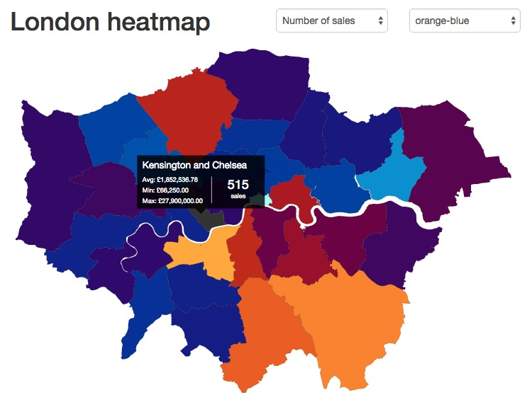

# Clojure/Clojurescript workshop

(WS-LDN-2)

This repo contains a subset of commented examples created during the workshop.

## Report

- [workshop report](https://medium.com/@thi.ng/workshop-report-building-linked-data-heatmaps-with-clojurescript-thi-ng-102e0581225c) - a slightly wordy (3k) report with lots of references
- [notes & further reading links](workshop.org)

## Example app

We used geographic data from the
[ONS linked data portal](http://statistics.data.gov.uk/) and sampled &
converted housing datasets from the
[London Data Store](http://data.london.gov.uk/dataset/average-house-prices-borough)
to RDF in order to build heatmap visualizations of the London housing
situation:

This heatmap shows average property sale prices per borough in 2013/14:


This heatmap is based on the number of property sales, showing a clear bias in the south east:



The example app also includes an in-browser query editor (using
[CodeMirror](http://codemirror.net)) with result table display and
query structure visualization.

## Running the project

```
git clone https://github.com/thi-ng/ws-ldn-2.git
cd ws-ldn-2
lein trampoline run

# open another terminal using same directory
lein fighweel dev

# once fabric server is running CLJS compilation is complete...
# open http://localhost:8000 in your browser
```

## CLJS build w/ advanced optimizations

Run the following command to build the CLJS sources with advanced optimizations:

```
lein do clean, cljsbuild once min
```

## License

Copyright © 2015 Karsten Schmidt

Distributed under the Apache Software License either version 1.0 or (at your option) any later version.
